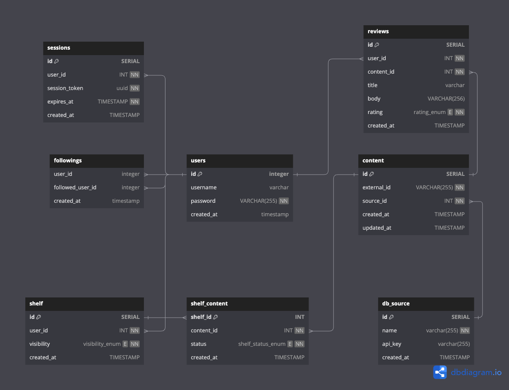

# Shelved

Log all of your media, in one place

## Overview

This application is a full-stack setup using Deno, Postgres, and Adminer, all configured through Docker Compose. It allows for efficient development and database management in a containerized environment. This README will guide you through setting up, running, and configuring the application, as well as explain the future improvements planned for the production setup.

## Prerequisites

- [Docker](https://docs.docker.com/get-started/get-docker/) installed on your system.
- [Deno](https://deno.com/) installed locally if you want to run the application outside of Docker.

## Getting Started

### Deno Commands

1. **Development Mode**:
   ```bash
   deno task format & #runs fromatter in the background
   deno task dev
   ```
   - Starts the server in development mode with hot-reloading enabled for quicker development iterations.

2. **Production Mode**:
   ```bash
   deno task start
   ```
   - Runs the application in production mode. This version is optimized and doesn’t include hot-reloading.

### Permissions Explained

   - `--allow-net`: Grants network access to the application.
   - `--allow-read`: Allows file reading for accessing configurations.
   - `--allow-env`: Enables access to environment variables needed for configuration management.

### Docker Compose Setup

The project includes a Docker Compose configuration file (`docker-compose.yml`) that sets up:
1. **Database (Postgres)**
   - **Port**: `5432`
   - Accessible locally via `localhost:5432`.
   - Database credentials and settings are defined in the `.env` file.

2. **Adminer**
   - **Port**: `8080`
   - Accessible via `http://localhost:8080` for managing the Postgres database.
   - Ensure `ADMINER_DESIGN` and other variables are correctly set in the `.env` file.

3. **Deno Fullstack App**
   - **Port**: `3000`
   - Accessible via `http://localhost:3000`.
   - Communicates with the Postgres database using environment variables defined in `.env`.

### Running the Environment

To start all services, use:
```bash
docker-compose up --build
```
- This command will build the Docker images and start the services as defined in the `docker-compose.yml` file.

Since we really only care about the output of the core app most of the time:
```bash
docker-compose up --build --attach shelved
```
  
To stop all services:
```bash
docker-compose down
```

## Environment Variables

The `.env` file contains necessary environment variables for the application and database:
- `POSTGRES_USER`, `POSTGRES_PASSWORD`, `POSTGRES_DB`, etc.
- `ADMINER_DESIGN` for customizing Adminer's appearance.

Additionally, `env.json` is used to define connection details for the application, such as database host, port, user, and password. Ensure these match your Docker settings.

Note that `env.json` will automatically populated by the `entrypoint.sh` script if running with docker. So there is no need to set variables in that case.

## Authentication

We are using cookie based authentication. Use the following curl commands as reference when working with auth:

```sh
# create an account
curl -X POST -H 'Content-Type:application/json' -d '{"username": "abcde", "password": "apassword"}' http://localhost:3000/create


# log in with correct password
# should receive cookie with different token from before in response headers
curl -v -X POST -H 'Content-Type:application/json' -d '{"username": "abcde", "password": "apassword"}' http://localhost:3000/login


# change REPLACE to equal a valid token cookie you received from the server when logging in
# copy the whole cookie, e.g. if you received the header
# Set-Cookie: token=bdb07b7844a7e63a321e0fb618ec3871a1421b3cbf37f1ae2906ff75e4084b17; Path=/; HttpOnly; Secure; SameSite=Strict
# your command should be
# curl --cookie "token=bdb07b7844a7e63a321e0fb618ec3871a1421b3cbf37f1ae2906ff75e4084b17; Path=/; HttpOnly; Secure; SameSite=Strict" http://localhost:3000/private
curl --cookie "REPLACE" http://localhost:3000/whoami

# log out
curl --cookie "REPLACE" -X POST http://localhost:3000/logout
```

## Database

### Schema

- Schema is available for inspection as Database Markup Language [schema.dbml](./database/schema.dbml)



### Migrations

Using Knex, you can manage database migrations directly through Deno tasks. Migrations allow you to define database schema changes and apply them consistently across environments.

- **Run Migrations**:
  ```bash
  deno task migrate
  ```
  This command applies the latest migrations to your database.

- **Create a New Migration**:
  ```bash
  deno task make_migration <migration_name>
  ```
  Replace `<migration_name>` with a descriptive name for your migration. This will generate a new migration file in the designated migrations folder, which you can edit to define specific schema changes.

- **Development Migrations**:
  ```bash
  deno task migrate_dev
  ```
  Runs migrations in a local development environment.

### Seeding

Seeding populates your database with initial data, which is especially useful for testing and development.

- **Run Seeds**:
  ```bash
  deno task seed
  ```
  This command will run the seed files and insert data into your database as defined.

- **Create a New Seed File**:
  ```bash
  deno task seed_make <seed_name>
  ```
  Replace `<seed_name>` with a descriptive name for your seed file. This will generate a new seed file in the seeds directory, which you can customize to insert specific records.

- **Development Seeding**:
  ```bash
  deno task seed_dev
  ```
  Executes seeds for the development database, enabling you to reset or pre-populate data in a local environment.


## Accessing the Application

- **Adminer**: Access via `http://localhost:8080` to manage the database easily through the UI.
- **Deno App**: Access the application at `http://localhost:3000`.
- **Postgres Server**: Access the application at `http://localhost:5432`

## Future Improvements

We plan to implement a production configuration that includes:
- A dedicated Dockerfile for production builds with optimized settings.
- Security improvements such as environment-specific variables and secret management.
    - I left the env.json file for an example, I would rather just use DENO.env to get all the env variables
- Deployment scripts for cloud-based hosting.

## LSP settings

These are my lsp settings, you can pick and choose some and add them accordingly

You can just copy it and add it to the [deno.json](./src/deno.json)
Refer to this [Deno LSP](https://docs.deno.com/runtime/getting_started/setup_your_environment/#editors-and-ides)

```json
{
  "lsp": {
    "compilerOptions": {
      "enable": true,
      "codeLens": {
        "implementations": true,
        "references": true,
        "referencesAllFunctions": true,
        "test": true
      },
      "suggest": {
        "imports": {
          "autoDiscover": true,
          "hosts": {
            "https://deno.land": true
          }
        },
        "autoImports": true,
        "completeFunctionCalls": true,
        "names": true,
        "paths": true
      },
      "inlayHints": {
        "enumMemberValues": {
          "enabled": true
        },
        "functionLikeReturnTypes": {
          "enabled": true
        },
        "parameterNames": {
          "enabled": "all",
          "suppressWhenArgumentMatchesName": false
        },
        "parameterTypes": {
          "enabled": true
        },
        "propertyDeclarationTypes": {
          "enabled": true
        },
        "variableTypes": {
          "enabled": true,
          "suppressWhenTypeMatchesName": false
        }
      },
      "lint": true,
      "future": true,
      "testing": {
        "args": ["--allow-all", "--no-check"]
      }
    }
  }
}
```
